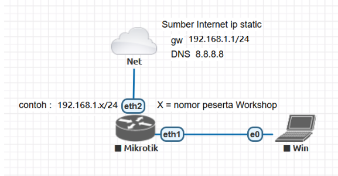

# LAB-5
tanggal 12 agustus 2025 
# Mengkoneksikan mikrotik ke internet  
**A. konfigurasi mikrotik ke internet dengan IP dynamic**
  

        1.pasangkan pengkabelan LAN sesui topologi 
          ether1-WAN (untuk koneksi ke Internet), dan
          ether2-LAN (untuk koneksi ke PC Klien)

      2.Konfigurasi DHCP Client ether1-WAN agar dapat IP dari ISP/internet:
        IP>DHCP client
        klik +
        masukan interface=ether1-WAN  
        klik, Apply   
        lalu OK  

      cek tab status untuk melihat IP yang di dapatkan ether1-WAN  

      3.melakukan pengujian koneksi mikrotik ke internet lewat terminal:  

jika kalian ingin laptop/pc kalian terkoneksi ke internet maka lanjutkan dengan cara :

      4.Melakukan seting IP pada interface ether2-LAN::  
        IP>AddreS  
        klik +   
        masukan interface, address seperti di gambar.  
        apply lalu OK. 
     
 

     5.Lakukan konfigurasi NAT, agar PC Klien dapat terkoneksi Internet melewati Mikrotik:  
       IP>Firewall>NAT  
       klik +  
       isi tab general dan action: lihat seperti di gambar  
       Apply lalu ok.

    6.Lalu konfigurasi DHCP server:  
      IP>DHCP Server  
      pilih DHCP setup   
      pilih ether2-LAN   
      klik next hingga selesai  

     7. yang terakhir konfigursi DNS:  
        IP>DNS   
        masukan server=8.8.8.8 (ip google)  
        klik Applay lalu OK.

    8.Jika sudah, setting IP di windows Control Panel,  
      ubah jadi DHCP/Obtain Auto.  
      Sekarang Client bisa terhubung ke internet

**B. konfigurasi mikrotik ke internet dengan IP tatic**

1. masuk ke IP>address  
2. klik +  
3. masukan address yang satu network dengan isp  
   *jika tida tau ip isp bisa di cek di ip dhcp client  
4. pilih ether1/isp  
5. buka IP>DNS masukan dns google 8.8.8.8   
6. klik apply lalu ok  
7. buka IP>routes  
8. masukan gateway  
9. pengujian nya di terminal dengan cara ping google.com  
10.Sekarang Client bisa terhubung ke Internet  

# Kesimpulan
ip Dynamic yaitu konfigurasi yang clientnya mendapat IP secara otomatis.  
Sedangkan ip Static adalah konfigurasi yang harus di seting satu-satu termasuk clinetnya.

