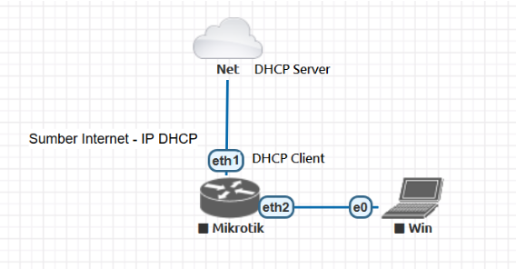
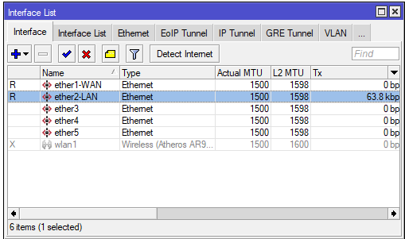
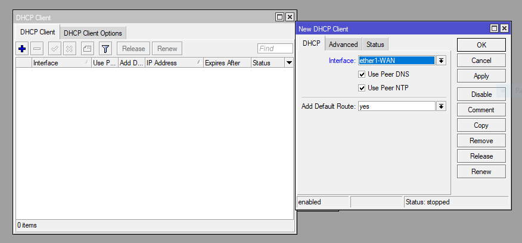
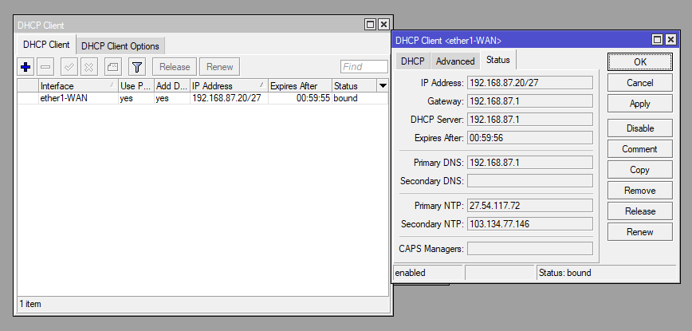
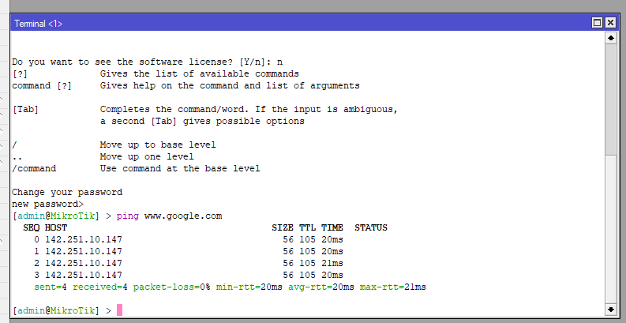
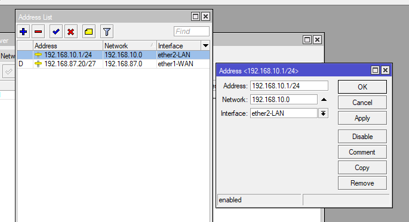
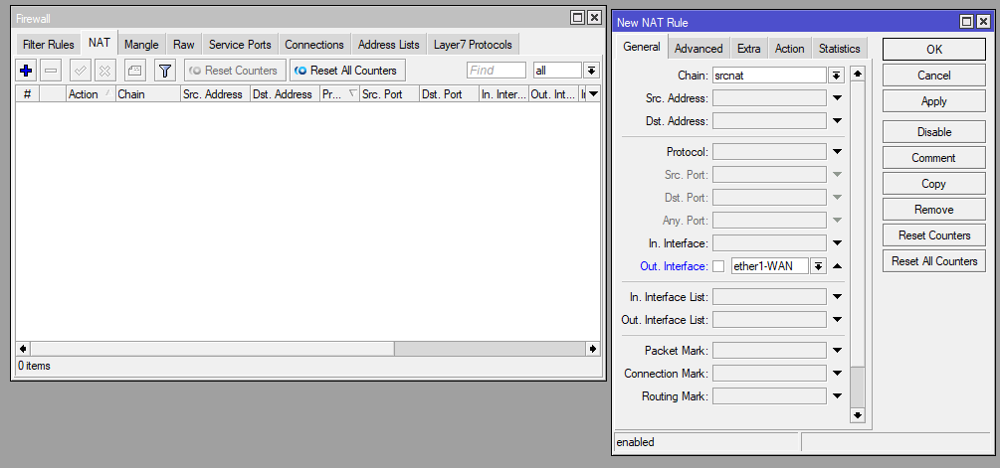
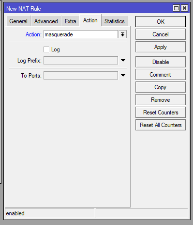
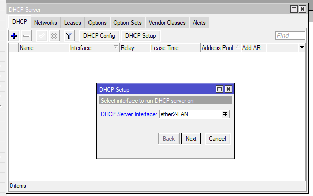
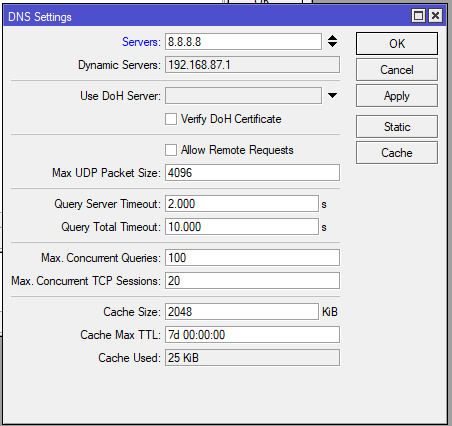

# LAB-5
tanggal 12 agustus 2025 
# Mengkoneksikan mikrotik ke internet  
A. konfigurasi mikrotik ke internet dengan IP dynamic
  

          pasangkan pengkabelan LAN sesui topologi 
          ether1-WAN (untuk koneksi ke Internet), dan
          ether2-LAN (untuk koneksi ke PC Klien)

      onfigurasi DHCP Client ether1-WAN agar dapat IP dari ISP/internet:
      IP>DHCP client
      klik +
      masukan interface=ether1-WAN  
      klik, Apply   
      lalu OK  

      cek tab status untuk melihat IP yang di dapatkan ether1-WAN  

      melakukan pengujian koneksi mikrotik ke internet lewat terminal:  

     Melakukan seting IP pada interface ether2-LAN::  
     IP>AddreS  
     klik +   
     masukan interface, address seperti di gambar.  
     apply lalu OK. 
     
 

    Lakukan konfigurasi NAT, agar PC Klien dapat terkoneksi Internet melewati Mikrotik:  
    IP>Firewall>NAT  
    klik +  
    isi tab general dan action: lihat seperti di gambar  

    Lalu konfigurasi DHCP server:  
    IP>DHCP Server  
    pilih DHCP setup   
    pilih ether2-LAN   
    klik next hingga selesai  

    yang terakhir konfigursi DNS:  
    IP>DNS   
    masukan server=8.8.8.8 (ip google)  
    klik Applay lalu OK.

